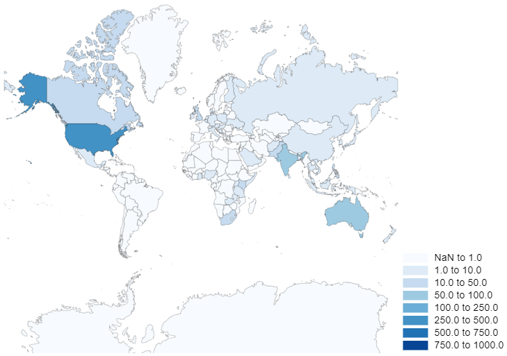
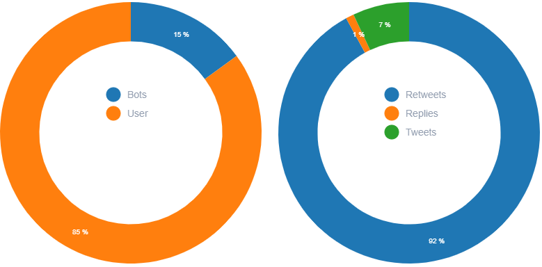
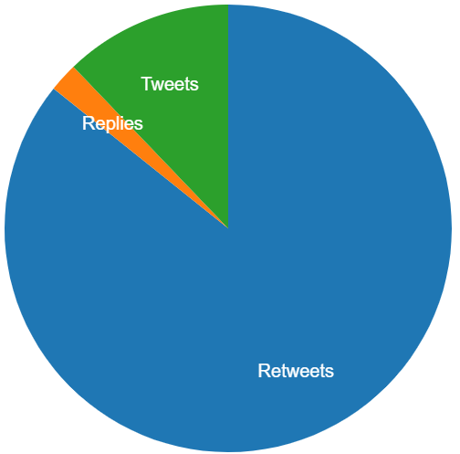

# **Project Phase 2 - Analyzing Tweets**
## **Principles of Big Data Management \(CS 5540\)**
----------------
>## **Authors**: 
>- ## **Jonathan Wolfe**
>- ## **Rod Skoglund**
>### Date: April 25, 2020
----------------

# **Table Of Contents**
1. [Design](#Design)
2. [Libraries](#Libraries)
3. [Queries](#Queries)
4. [Visualizations](#Visualizations)
5. [Code](#Code)
6. [Demo and Setup](#Demo-and-Setup)
7. [Work Assignments](#Work-Assignments)
8. [References](#References)
----------------

# Design
### The design involved several steps to develop this analysis.
  1. Developed Java script to pull Tweet information and extract Hashtags and URLS
      * Captured 250k tweets containing #coronavirus and filtered to only include tweets in english
      * It used Java library, twitter4j-4.0.7, to access the Twitter API
      * Saved the collected tweets into files with each tweet JSON per line
      * All files were limited to approximately 64MB size by writting a new file if it may exceed the size
  2. Developed and implemented queries to provide data for visualations using java and accessing the spark library
  3. Hosted a jetty REST API server in the application utilizing Spark to run queries
  4. Developed a connection to the REST API through an Ionic application developed using Angular
  5. Used D3 to create visualations including
  6. Docker was utilized to containerize the REST API server and Ionic web application server
      
---
# Libraries
We used numerous libraries to collect, analyze and display the data:
* twitter4j-4.0.7
* Appache Spark 2.4.5
* Spark SQL 2.4.5
* jetty 9.4.28.v20200408
* Gson 2.8.6
* Angular
* Ionic
* D3
* Docker
---

# Queries
### Here are the queries we used to get and analyze the data:
1. Bubble Chart Data - a hashtagCount query is defined to capture the number of times a a tweet mentiones each Hashtag. We remove all Hashtags that are mentioned in less than 10 tweetss. 
2. Influencers - the Influencers query will capture the users with the most followers \(these are verified followers\). The query is ordered by the number of followers and we limit the data to the top 50 influencers. 
3. Top Hashtags Overall - This query is used to capture the top ten Hashtags based on the number of tweets that reference the Hashtag.
4. Bots Data - made up from multiple queries. This is developed by capturing the users where the "user.statuses_count", "user.created_at" and tweet "created_at" fields all have data (they are not null fields). This data is used to determine the users with more than 50 tweets per day. The data is grouped by users and captures the counts for Tweets per day, Days since started, user name and description
5. Coronavirus tweet, retweet and response freqencies - 
6. Coronavirus tweets grouped by country -
7. Coronavirus tweet GPS coordinates - 
8. Top 10 hastags over time -
9. Most retweeted tweet of corona with follower count and listed -
10. News agency influences -
---

# Visualizations
### Our analysis included a sample of 100k coronavirus related tweets.
## Word Cloud of Usernames with Greatest Influence

## Coronavirus Hashtag Bubble Chart:
Each bubble is a different corona virus Hashtag with the number of tweets associated with that Hashtag.  

## Coronavirus Top 10 Hashtag Bar Chart:
This only shows Hashtags with more than 10 tweets.  

## World Countries Map of Coronavirus Tweets

## Donut Charts of Bot Frequencies and activities

## Pie Chart of User Tweet Activity

## World Map of Coronavirus tweet GPS coordinates - Still in development

## Multiple Line Graph of Top 10 hastags over time - Still in development

## Stacked Area Graph of Most retweeted tweet of corona with follower count and listed - Still in development

## Layered Bar Graph of News agency influences - Still in development

---

# Code
The code is stored and managed via GitHub. It is available at [Wolfe-Skoglund GitHub code](https://github.com/JAWolfe04/CS5540-Big-Data-Project.png)
---

# Demo and Setup
### The Demo will be shown to the instructor and TA's at a convenient date/time.

### Here are the instructions for setting up and displaying the data analysis.
1. A file called Dataset containing tweet data files will need to be created as //c/Users/Dataset to serve the application data.
2. Best method would be to retrieve the image from docker and run the image otherwise I am uncertain how to run it outside of a development environment
---

# Work Assignments

- Installations & Setup: 
  * Wolfe
  * Skoglund
- Coding:
  * Wolfe \(99%\)
  * Skoglund \(1%\)
- Phase #2 documentation:
  * Wolfe
  * Skoglund
 
---

# References

1. [GitHub REST API | Get remote repo files list & download file content programmatically without cloning in local](https://itsallbinary.com/github-rest-api-get-remote-github-repo-files-list-download-file-content-programmatically-without-cloning-in-local/)
2. [Building Real-time interactions with Spark](https://spoddutur.github.io/spark-notes/build-real-time-interations-with-spark.html)
3. [How to send HTTP request GET/POST in Java](https://mkyong.com/java/how-to-send-http-request-getpost-in-java/)
4. [Embedding Jetty](https://www.eclipse.org/jetty/documentation/current/embedding-jetty.html)
5. [Twitter search API- Get tweets and tweets count of hashtag using JAVA twitter client Twitter4j](http://jkoder.com/twitter-search-api-get-tweets-and-tweets-count-hashtag-java-client-twitter4j/)
6. [Docker and Java Application examples](https://mkyong.com/docker/docker-and-java-application-examples/)
7. [#BotSpot: Twelve Ways to Spot a Bot](https://medium.com/dfrlab/botspot-twelve-ways-to-spot-a-bot-aedc7d9c110c)
8. [D3-cloud Github](https://github.com/jasondavies/d3-cloud)
9. [Create a simple Donut Chart using D3.js](http://www.adeveloperdiary.com/d3-js/create-a-simple-donut-chart-using-d3-js/)
