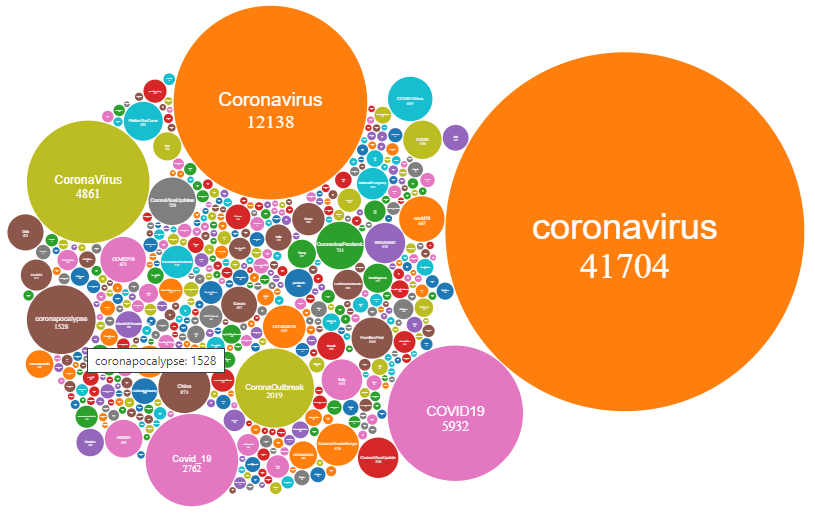
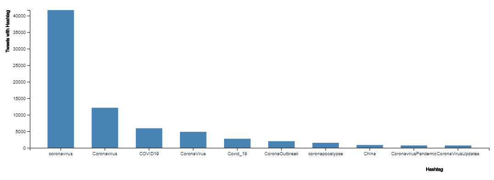

# **Project Phase 2 - Analyzing Tweets**
## **Principles of Big Data Management \(CS 5540\)**
----------------
>## **Authors**: 
>- ## **Jonnathan Wolfe**
>- ## **Rod Skoglund**
>### Date: April 25, 2020
----------------

# **Table Of Contents**
1. [Design](#1.-design)
2. [Tweet Storage](#2.-tweet-storage)
3. [Queries](#3.-queries)
4. [Visualizations](#4.-visualizations)
5. [Code](#5.-code)
6. [Demo and Setup](#6.-Demo-and-setup)
7. [Work Assignments](#7.-work-assignments)
----------------

# 1. Design
### The design involved several steps to develop this analysis.
  1. Installed Cloudera which includes the following:
      * Hadoop
      * Spark
      * Yarn
  2. Developed Java script to pull Tweet information and extract Hashtags and URLS
      * Captured 100K tweets, approximately 10 hours of stream sampling
      * Used Java library, twitter4j-4.0.7, to access Twitter Streaming API
      * Selected tweets over all other messages
      * Excluded retweets and replies
      * Only captured tweets containing Hashtags or URLs
      * Saved the collected tweets into files with each tweet JSON per line
      * Extracted Hashtags and URLs from the collected tweets
      * Saved the Hashtags and URLs into a text file with 10 Hashtags or URLs per line
      * All files were limited to approximately 64MB size by writting a new file if it may exceed the size
  3. Used the Spark Word Counter capability to produce the word count analysis data.
		   * Used Cloudera default configuration on a pseudo-distributed system
		   * Transferred files with extracted Hashtags/URLs into hadoop file system within the VM
		   * Transferred files were saved in a input folder to be used by Spark
		   * Once Spark was finished, the results were extracted from hadoop and transferred out of the VM
  4. Developed and implemented queries to provide data for visualations
  5. Used D3 to create visualations including 
      * A Bubble Chart to compare the different Hashtags associated with the corona virus and how often each Hashtag is used.
      * A Bar Chart to show the top Hashtags in use.
---

# **2. Tweet Storage**
### A folder that contains multiple tweet files \(less than 64MB\) in a text format with each line that contains one tweet. Each line is a JSON format for a single tweet, but because it is not in a single named array with commas at the end of each line and it does not have keys associated with each line, the file is not a true JSON formatted file.
---

# **3. Queries**
### Here are the queries we used to get and analyze the data:
1. Bubble Chart Data - a hashtagCount query is defined to capture the number of times a a tweet mentiones each Hashtag. We remove all Hashtags that are mentioned in less than 10 tweetss. 
2. Influencers - the Influencers query will capture the users with the most followers \(these are verified followers\). The query is ordered by the number of followers and we limit the data to the top 50 influencers. 
3. Top Hashtags Overall - This query is used to capture the top ten Hashtags based on the number of tweets that reference the Hashtag.
4. Bots Data - made up from multiple queries. This is developed by capturing the users where the "user.statuses_count", "user.created_at" and tweet "created_at" fields all have data (they are not null fields). This data is used to determine the users with more than 50 tweets per day. The data is grouped by users and captures the counts for Tweets per day, Days since started, user name and description
---

# **4. Visualizations**
### Our analysis included a Bubble Chart with a sample of 100k corona relatrd tweets. Each bubble is a different corona virus Hashtag with the number of tweets associated with that Hashtag. This only shows Hashtags with more than 10 tweets.
## Corona Virus Hashtag Bubble Chart:

### We also included a Bar Chart with the top 10 Hashtags.
## Corona Virus Top 10 Hashtag Bar Chart:

---

# **5. Code**
The code is stored and managed via GitHub. It is available at [Wolfe-Skoglund GitHub code](https://github.com/JAWolfe04/CS5540-Big-Data-Project.git)
---

# **6. Demo and Setup**
### The Demo will be shown to the instructor and TA's at a convenient date/time.

### Here are the instructions for setting up and displaying the data analysis.
1. # \<Need to define these instructions\>
2.
---

# **7. Work Assignments**

- Installations & Setup: 
  *	Wolfe
  * Skoglund
- Coding:
  * Wolfe \(99%\)
  * Skoglund \(1%\)
- Phase #2 documentation:
  *	Wolfe
  * Skoglund
 
---
